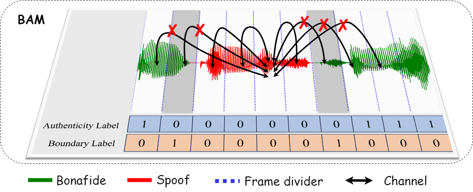

# BAM

[](https://zenodo.org/doi/10.5281/zenodo.12747416)

This is the pytorch implementation of our work [Enhancing Partially Spoofed Audio Localization with Boundary-aware Attention Mechanism](https://arxiv.org/abs/2407.21611).




# Enviroment

Our training code is base on [Pytorch-lightning](https://lightning.ai/docs/pytorch/stable/). we need install following dependency firstly.

```python
conda create -n bam python=3.8
conda activate bam
pip install torch
pip install lightning==2.1 pytorch-lightning==2.1
pip install scikit-learn
pip install s3prl
pip install librosa
pip install tensorboard
```
# Usage
## Data preparation
Change the `partialspoof_path` in [ps_preprocess.py](/dataset/ps_preprocess.py) to your PartialSpoof dataset path and run this python file.
The ps_preprocess.py is to extract boundary label from segment-level label. **Both training and inference need to run this step first**.

```python
python dataset/ps_preprocess.py 
```

The program will create a `data` folder in current direction with following structure:
```
|- data
      |- raw                      # audio data
            |- train
            |- dev
            |- dev
      |- boundary_0.16_labels     # boundary groundturth label
      |- dev_seglab_0.16.npy      # dev set authenticity groundturth label
      |- train_seglab_0.16.npy    # train set authenticity groundturth label
      |- eval_seglab_0.16.npy     # eval set authenticity groundturth label

```
## Training
Run the default configuration with WavLM pre-trained model.
```python
python train.py --train_root ./data/raw/train --dev_root ./data/raw/dev
```

Run the XLSR configuration.
```
python train.py --exp_name bam_xlsr --train_root ./data/raw/train --dev_root ./data/raw/dev
```

## Evaluation
we also provide checkpoint in `./checkpoint/model.ckpt`. Please download the modl checkpoint file from [Google driver](https://drive.google.com/file/d/1eL3Ca27hEruI20lkoqkQEnZlb2GzTyHT/view?usp=sharing). 
The evaluation process might take some time and will require approximately 4GB of GPU memory.
```
python train.py --test_only --checkpoint ./bam_checkpoint/model.ckpt --eval_root ./data/raw/eval
```

Please feel free to contact us if there is anything we can do to support your work.

# Citation
If you use this code and result in your paper, please cite our work as:
```
@article{zhong2024enhancingpartiallyspoofedaudio,
      title={Enhancing Partially Spoofed Audio Localization with Boundary-aware Attention Mechanism}, 
      author={Jiafeng Zhong and Bin Li and Jiangyan Yi},
      year={2024},
      eprint={2407.21611},
      archivePrefix={arXiv},
      primaryClass={cs.SD},
      url={https://arxiv.org/abs/2407.21611}, 
}
```

